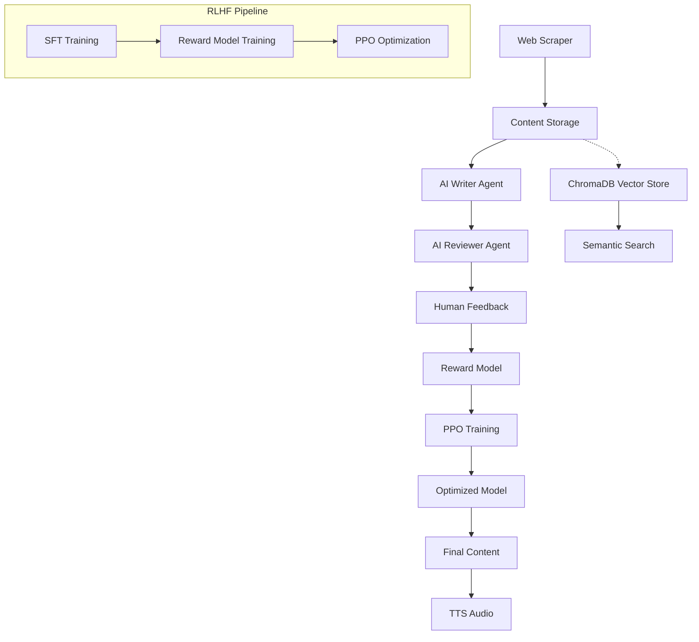

# 📚 **Automated Book Publication Workflow with RLHF**
 **Reinforcement Learning from Human Feedback (RLHF)** to transform web-scraped content into high-quality, engaging book chapters. The system uses Microsoft's Phi-3 model with advanced memory optimization techniques to run efficiently on consumer GPUs.

## 🌟 **Features**

- **🕷️ Web Scraping**: Automated content extraction from Wikisource and other sources
- **🤖 AI Content Enhancement**: Phi-3 powered text rewriting with creative improvements  
- **🎯 RLHF Pipeline**: Complete 3-stage training (SFT → Reward Model → PPO)
- **🔍 Semantic Search**: ChromaDB integration with deterministic filtering
- **👥 Human-in-the-Loop**: Multi-iteration feedback system for quality control
- **🗣️ Text-to-Speech**: Multi-engine audio generation with voice support
- **💾 Memory Optimized**: Runs on 8GB VRAM using 4-bit quantization + LoRA
- **🌐 REST API**: FastAPI-based workflow coordination
- **📊 Version Control**: Comprehensive content versioning and tracking

## 🏗️ **Architecture Overview**



## 🚀 **Quick Start**

### **Prerequisites**

- **Hardware**: NVIDIA GPU with 8GB+ VRAM (tested on RTX 4060)
- **Software**: Python 3.11+, CUDA 12.6, Git

### **Installation**

1. **Clone the repository**
   ```bash
   git clone https://github.com/Yaduvir06/automated-book-workflow.git
   cd automated-book-workflow
   ```

2. **Create virtual environment**
   ```bash
   python -m venv venv_book_workflow
   # Windows
   venv_book_workflow\Scripts\activate
   # Linux/Mac
   source venv_book_workflow/bin/activate
   ```

3. **Install PyTorch with CUDA**
   ```bash
   pip install torch torchvision torchaudio --index-url https://download.pytorch.org/whl/cu126
   ```

4. **Install requirements**
   ```bash
   pip install -r requirements.txt
   ```

5. **Install Playwright browsers**
   ```bash
   playwright install
   ```

6. **Verify CUDA setup**
   ```bash
   python -c "import torch; print(f'CUDA Available: {torch.cuda.is_available()}')"
   ```

### **Quick Demo**

1. **Start the web application**
   ```bash
   cd src
   python web_app.py
   ```

2. **Process your first chapter**
   ```bash
   curl -X POST http://localhost:5000/spin \-H "Content-Type: application/json" -d "{"url": "https://en.wikisource.org/wiki/The_Gates_of_Morning/Book_1/Chapter_1"}"
   ```

3. **Search processed content**
   ```bash
   curl "http://localhost:5000/search?q=chapter%20opening"
   ```
4.**Make better prompts examples:**
```bash

curl -X POST http://localhost:5000/feedback -H "Content-Type: application/json" -d "{\"prompt\": \"Rewrite this chapter opening:\", \"good\": \"The morning mist clung to ancient stones, whispering secrets of forgotten times.\", \"bad\": \"It was morning and there was mist on some stones.\"}"
```

## 📁 **Project Structure**

```
automated_book_workflow/
├── src/                          # Core application code
│   ├── scraper.py               # Web scraping functionality
│   ├── llm_utils.py             # LLM model loading and generation
│   ├── reward_model.py          # Custom reward model implementation  
│   ├── chroma_search.py         # Vector database management
│   ├── tts_module.py            # Text-to-speech integration
│   └── web_app.py               # FastAPI web interface
├── training/                     # RLHF training scripts
│   ├── train_sft.py             # Supervised Fine-Tuning
│   ├── train_reward_model.py    # Reward model training
│   └── train_rlhf.py            # PPO training
├── data/                        # Data storage
│   ├── preferences.jsonl        # Human feedback data
│   ├── models/                  # Trained model storage
│   ├── chroma/                  # Vector database
│   └── screenshots/             # Page screenshots
├── config/                      # Configuration files
├── requirements.txt             # Python dependencies
└── README.md                    # This file
```
IMPORTANT:
After PPO training completes, update your src/llm_utils.py to use the final model:

python
# Update src/llm_utils.py to use the final PPO model
def load_standard_model(model_name: str = "../data/models/ppo_policy"):  # Use PPO model
    # ... rest of your model loading code

## 🎯 **API Endpoints**

### **Content Processing**
- `POST /spin` - Transform web content using AI
- `GET /search` - Semantic search with filters
- `POST /feedback` - Submit human feedback for RLHF

### **System Management**  
- `GET /stats` - System statistics and metrics
- `GET /content/{id}` - Retrieve content and versions

### **Example Usage**

```python
import requests

# Spin a chapter
response = requests.post('http://localhost:5000/spin', json={
    'url': 'https://en.wikisource.org/wiki/Example_Chapter'
})

# Submit feedback for training
requests.post('http://localhost:5000/feedback', json={
    'prompt': 'Enhance this dialogue:',
    'good': 'Vivid, engaging dialogue example...',
    'bad': 'Basic dialogue example...'
})

# Search with quality filter
results = requests.get('http://localhost:5000/search', params={
    'q': 'fantasy castle',
    'status': 'approved'
})
```

## 🏋️ **Training Pipeline**

### **1. Supervised Fine-Tuning (SFT)**
```bash
cd training
python train_sft.py
```
- **Purpose**: Teach the model book writing style
- **Duration**: ~30 minutes on RTX 4060
- **Output**: `data/models/sft_finetuned/`

### **2. Reward Model Training**
```bash
python -c "import sys; sys.path.append('..'); from src.reward_model import train_reward_model; train_reward_model()"
```
- **Purpose**: Learn human preferences for text quality
- **Duration**: ~45 minutes on RTX 4060
- **Output**: `data/models/reward_model/`

### **3. PPO Optimization**
```bash
python train_rlhf.py  
```
- **Purpose**: Optimize policy using reward model
- **Duration**: ~90 minutes on RTX 4060
- **Output**: `data/models/ppo_policy/`

### **Training Data Requirements**

| Stage | Data Needed | Minimum | Recommended |
|-------|-------------|---------|-------------|
| **SFT** | High-quality examples | 20 | 50-100 |
| **Reward Model** | Preference pairs | 50 | 100-200 |
| **PPO** | Uses existing data | - | - |

## ⚙️ **Configuration**

### **Memory Optimization (RTX 4060)**

```python
# config/memory_config.yaml
hardware:
  gpu_memory_gb: 8
  target_memory_usage: 0.85
  
quantization:
  enabled: true
  type: "4bit"
  compute_dtype: "float16"
  
lora:
  r: 8
  alpha: 32
  target_modules: ["q_proj", "k_proj", "v_proj", "o_proj"]
```

### **Model Configuration**

```python  
# Default model settings
BASE_MODEL = "microsoft/Phi-3-mini-4k-instruct"  # 3B parameters
QUANTIZATION = "4-bit"                            # ~2.5GB VRAM
LORA_RANK = 8                                     # Efficient fine-tuning
```

## 📊 **Performance Metrics**

### **Hardware Requirements**

| Component | Minimum | Recommended |
|-----------|---------|-------------|
| **GPU** | 8GB VRAM | 12GB+ VRAM |
| **CPU** | 8 cores | 16+ cores |
| **RAM** | 16GB | 32GB+ |
| **Storage** | 50GB | 100GB+ |

### **Processing Speed** (RTX 4060)

| Operation | Speed | Memory Usage |
|-----------|-------|--------------|
| **Text Generation** | ~15 tokens/sec | ~4GB VRAM |
| **SFT Training** | ~2 samples/min | ~4GB VRAM |
| **Reward Training** | ~5 pairs/min | ~3GB VRAM |
| **PPO Training** | ~1 step/min | ~6GB VRAM |


## 🐛 **Troubleshooting**

### **Common Issues**

**CUDA Out of Memory**
```bash
# Solution: Reduce batch size or enable CPU offloading
export PYTORCH_CUDA_ALLOC_CONF=max_split_size_mb:512
```

**Model Loading Errors**
```bash
# Solution: Clear cache and restart
rm -rf ~/.cache/huggingface/
python -c "import torch; torch.cuda.empty_cache()"
```

**Slow Training**
```bash
# Solution: Enable flash attention (optional)
pip install flash-attn --no-build-isolation
```

## 📄 **License**

This project is licensed under the MIT License - see the [LICENSE](LICENSE) file for details.
